1. 
sebelum melakukan pengkodingan flutter kita di wajib kan untuk menginstall flutter terlebih dahulu, untuk menginstallnya kita bisa menggunakan visual studio code atau android studio. setelah itu kita juga wajib untuk menginstal ekstension flutter pada sofware coding yang kita gunakan supaya memudahkan penginstalan flutter.
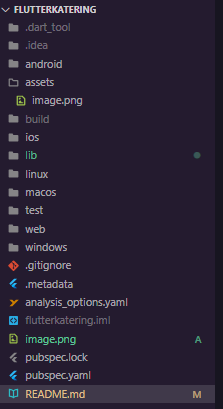
ini adalah hasil dari instalasi dari flutter yang sudah di instal pada visual studio code. yang berisi banyak folder dan file - file.
2. selanjut nya membuat repository pada github 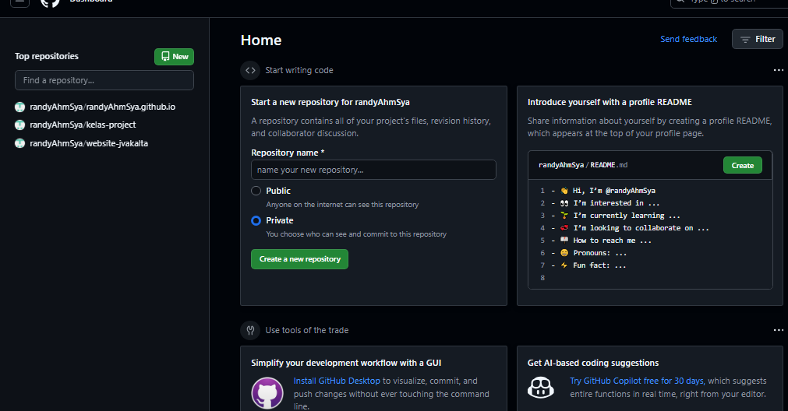 pada foto tersebut kita dapat membuat repositori dengan memasukan nama repository yang kita inginkan. sesudah itu masuk ke repository nya dan salin link  seperti contoh di samping sesuai link yang ada di repositori yang telah di buat.
kemudian kita kembali lagi ke vscode untuk mengepush/upload file kita dengan cara buka terminal dahulu selanjut nya ketik git init, lalu paste yang link yang sudah kita kopy, lalu git add . ,lalu git branch -M main, lalu git commit -m "pwsan yang ingin di tulis", lalu git push -u origin main.
jika sudah nantiakan seperti ini 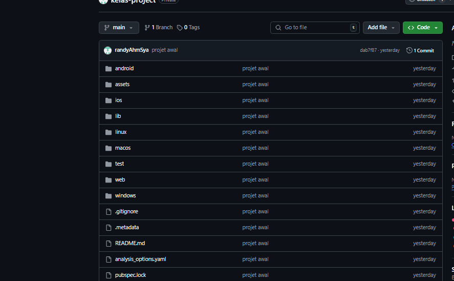.
3. jalankan program dengan menggunakan crome atau emulator dan nanti nya akan muncul gambar nya
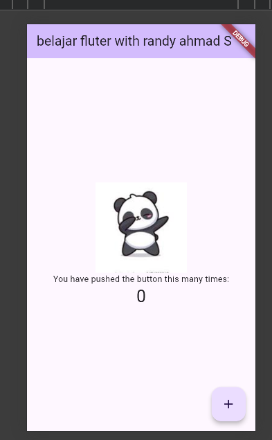
di atas merupakan gambar fluttr pertama kali di buat. dan di sana saya menambahkan gambar yang saya impoort pada file yang berbeda dibawah ini
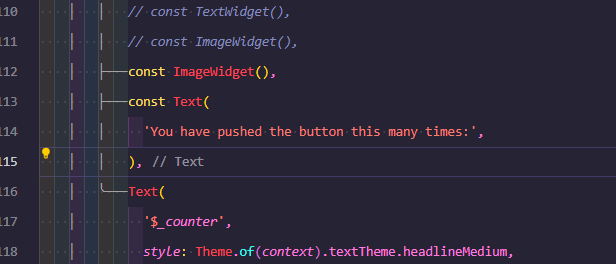
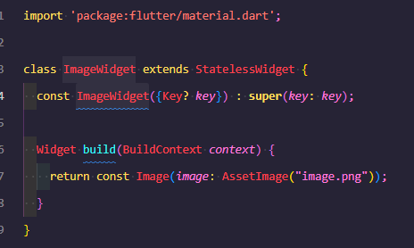
saya juga membuat style di dengan text yang saya buat berwarna merah dan berposisi di tengah dengan menggunakan textstyle. seperti dibawah ini:

4.a. kemudian saya membuat beberapa file lagi yang saya taruh di bawah ini:
membuat loading bar
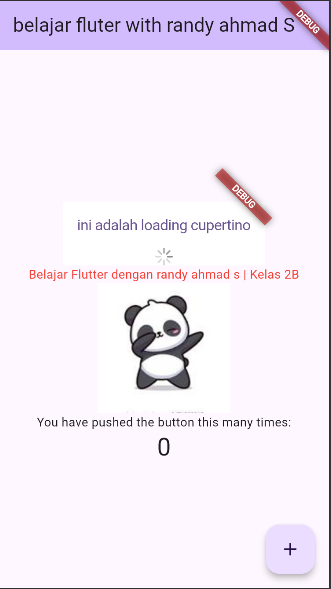
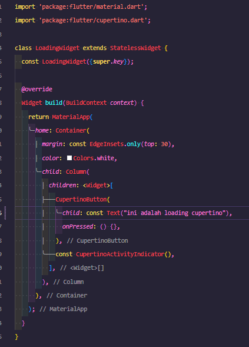
di atas adalah contoh loading nya untuk code nya berada di folder loading copertino.
b.saya juga membuat fab wigjet eperti tanda like

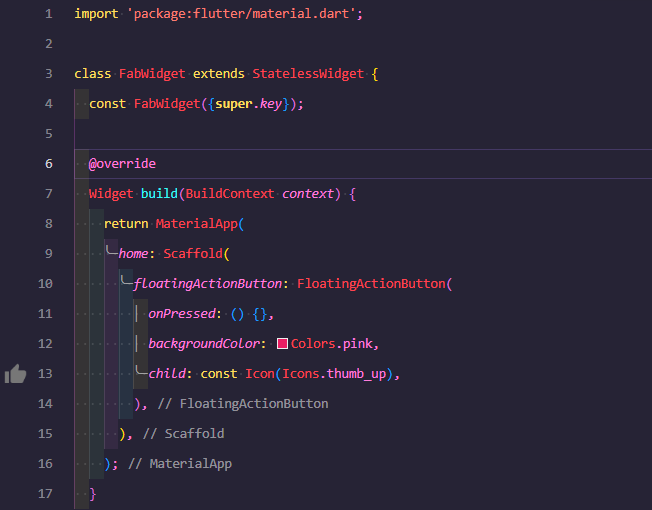file nya
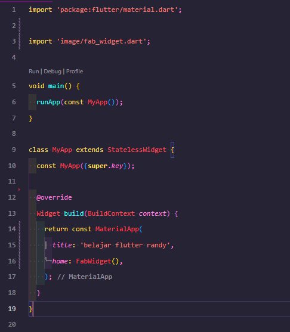file main nya
di atas merupakan file dari fab wigjet.yang telah saya buat
c.scaffold widget
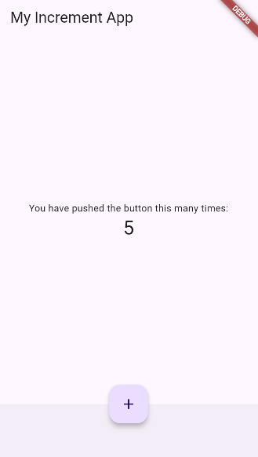
d.dialog widget

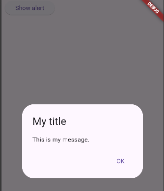
e.input selection
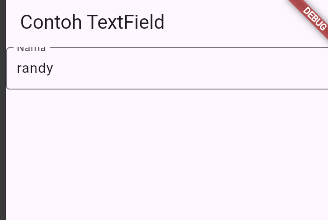
f.datetime picker
